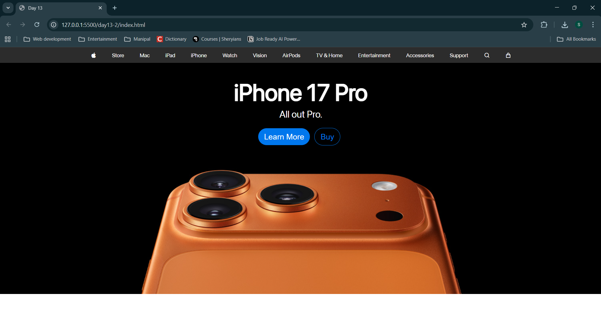

# Task: Replicate the apple website for practicing basic flexbox
In this lecture we created this basic webpage of apple.com with using flexbox.

## Created during Live Class

## Created afterwards

## Summaray
This will be a practice repository which will be updated by 03-10-25. I will be trying to replicate the apple webpage as much as possible without using responsiveness as it is not taught yet.